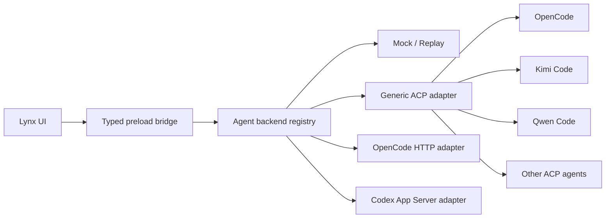

# Codex Demo Agent Backend Evaluation

Status: OpenCode ACP vertical slice implemented
Research snapshot: 2026-08-03

## Decision

Build a **UI-first, agent-neutral desktop client**. The product owns projects,
tasks, transcript rendering, approvals, review, and persistence. Agent runtimes
are replaceable adapters discovered through an `AgentBackendRegistry`.

The initial integration order is:

1. **Mock/Replay backend** so every UI state can be developed and tested without
   an account, API key, network connection, or installed agent.
2. **Generic ACP backend** over JSON-RPC/stdin/stdout. This single adapter can
   drive OpenCode, Kimi Code, Qwen Code, and future ACP-compatible agents.
3. **OpenCode native backend** over its headless HTTP/OpenAPI server when richer
   project, session, file, diff, provider, or event APIs materially improve the
   product over ACP.
4. **Codex App Server backend** over JSONL JSON-RPC for Codex-specific features.

OpenCode is the first real agent used to validate the generic ACP path. Kimi
Code is a compatibility target only until registration and model access can be
verified in the target environment.

“Any agent” means any agent implementing a supported machine protocol or a
small adapter. It does not mean parsing arbitrary interactive terminal output.



## Candidate Matrix

Popularity is a rough GitHub-star snapshot, not a quality score.

| Backend | Origin | Stars | License | Rich-client interface | Kimi K3 | Fit for this demo |
| --- | --- | ---: | --- | --- | --- | --- |
| Kimi Code CLI | Moonshot AI | 5.9k | MIT | ACP over stdio | Native, first-class, but account access is currently unverified | Compatibility target |
| Qwen Code | Alibaba/Qwen | 26.5k | Apache-2.0 | ACP, daemon HTTP+SSE, SDKs | Likely through OpenAI-compatible provider; preserved-thinking behavior needs a spike | Strong domestic option |
| TRAE Agent | ByteDance | 12.0k | MIT | CLI and Python-oriented server/framework | Likely through custom OpenAI base URL; K3-specific behavior needs a spike | Better for agent research than product embedding |
| OpenCode | International | 192.6k | MIT | ACP, headless HTTP/OpenAPI server, generated client | Official built-in Moonshot AI integration | **First real backend** |
| Codex CLI | OpenAI | 103.5k | Apache-2.0 | App Server JSON-RPC/JSONL, TypeScript and Python SDKs | Works through a Responses-to-Chat-Completions router | Best second backend for Codex parity |

Sources:

- [Qwen Code repository and supported modes](https://github.com/QwenLM/qwen-code)
- [Qwen Code model providers](https://github.com/QwenLM/qwen-code/blob/main/docs/users/configuration/model-providers.md)
- [TRAE Agent repository](https://github.com/bytedance/trae-agent)
- [OpenCode Kimi integration](https://platform.kimi.ai/docs/guide/open-code)
- [Codex repository](https://github.com/openai/codex)

## OpenCode Desktop

OpenCode has an official desktop application in beta for macOS, Windows, and
Linux. The current desktop package is an Electron wrapper around the shared Web
UI. OpenCode's core runs as a separate server, and its clients communicate with
that server through an OpenAPI-described HTTP interface.

We should not port or embed OpenCode Desktop as our UI. We should:

- use it as a behavior reference for sessions, permissions, model selection,
  diffs, and errors;
- reuse OpenCode's public agent protocols, not its Electron shell;
- preserve Lynxtron-native UI and process isolation;
- keep OpenCode removable without rewriting the product state model.

Sources:

- [OpenCode repository and desktop downloads](https://github.com/anomalyco/opencode)
- [OpenCode desktop package](https://github.com/anomalyco/opencode/tree/dev/packages/desktop)
- [OpenCode server architecture](https://opencode.ai/docs/server)
- [OpenCode ACP support](https://opencode.ai/docs/acp)

## Kimi K3 Compatibility Notes

Kimi K3's public endpoint is OpenAI-compatible **Chat Completions** at
`https://api.moonshot.ai/v1/chat/completions`. Tool calls and multi-turn use
must return the complete assistant message, including `reasoning_content`, to
the next request.

Current Codex CLI custom model providers use the **Responses API** wire format.
Moonshot's documented Codex integration therefore uses CC Switch as a local
router to translate requests and streaming responses between Responses and Chat
Completions. A simple Codex `base_url` override is not sufficient.

Sources:

- [Kimi K3 request and tool-call contract](https://platform.kimi.ai/docs/guide/kimi-k3-quickstart)
- [Kimi K3 with Codex CLI](https://platform.kimi.ai/docs/guide/codex-kimi)
- [Codex custom model providers](https://learn.chatgpt.com/docs/config-file/config-advanced#custom-model-providers)

## Product Contract

- **Source revision:** `codex/codex-demo`, based on local `main` at `f60dd4b`.
- **Artifact type:** a full showcase under `showcases/codex-demo`.
- **Distribution type:** packed showcase artifact with `dist/desktop/`.
- **Runtime path:** Lynx UI -> preload bridge -> host-owned agent process ->
  selected backend adapter. The UI never receives raw filesystem or process
  access.
- **Golden flow:** choose a workspace -> create a task -> stream reasoning and
  tool activity -> approve a command or edit -> inspect the changed-file diff ->
  stop or finish -> quit -> reopen and resume the task.

Non-goals for the first slice:

- Pixel-perfect parity with every Codex desktop surface.
- Cloud task execution, pull requests, plugins, automations, or multi-agent UI.
- A built-in model API proxy.
- Running multiple backend types inside one task. A task is permanently bound
  to the backend that created it; a new task may choose another backend.

## Proposed Layers

### Lynx UI

- project/task sidebar;
- transcript with streaming text, plan, command, tool, and error items;
- composer with send/stop;
- permission prompt;
- changed-files summary and review pane.

### Preload bridge

Expose narrow operations only:

```ts
agent.listBackends()
agent.probeBackend(backendId)
agent.startTask(options)
agent.listTasks(filter)
agent.loadTask(id)
agent.prompt(taskId, content)
agent.cancel(taskId)
agent.respondToPermission(requestId, decision)
agent.subscribe(taskId, cursor, callback)
```

### Host

- owns the backend registry and exactly one destructive stream reader per child
  process;
- launches each executable with an isolated, backend-specific data directory;
- performs protocol initialization and capability negotiation;
- validates workspace roots before starting a session;
- maps backend updates into an internal event envelope;
- owns process shutdown, cancellation, crash recovery, and bounded event replay.

Suggested host layout:

```text
src/main/desktop/agents/
  contracts.ts
  registry.ts
  runtime.ts
  adapters/
    mock.ts
    acp.ts
    opencode.ts
    codex-app-server.ts
```

### Backend descriptors

Installed agents are configuration, not hard-coded UI branches:

```ts
type AgentBackendDescriptor = {
  id: string;
  label: string;
  transport: 'mock' | 'acp-stdio' | 'opencode-http' | 'codex-app-server';
  command?: string;
  args?: string[];
  dataHomeEnv?: string;
  capabilities?: Partial<AgentCapabilities>;
};
```

The host probes the executable and negotiates actual capabilities. The UI uses
those capabilities to show, hide, or disable model selection, images, plans,
approvals, diffs, task resume, MCP configuration, and other optional features.

### Normalized backend contract

The initial event model should preserve backend-specific payloads while exposing
stable product events:

```ts
type AgentEvent =
  | { type: 'task'; task: AgentTask }
  | { type: 'message-delta'; taskId: string; text: string }
  | { type: 'reasoning-delta'; taskId: string; text: string }
  | { type: 'plan'; taskId: string; entries: PlanEntry[] }
  | { type: 'tool'; taskId: string; item: ToolItem }
  | { type: 'permission'; taskId: string; request: PermissionRequest }
  | { type: 'files-changed'; taskId: string; files: ChangedFile[] }
  | { type: 'turn-state'; taskId: string; state: TurnState }
  | { type: 'usage'; taskId: string; usage: AgentUsage }
  | { type: 'error'; taskId?: string; error: AgentError };
```

Every event also carries a monotonically increasing local cursor and the raw
backend payload for diagnostics. Do not force ACP, OpenCode, and Codex App
Server into identical wire semantics. Normalize only what the product renders
or controls.

## Credentials and Testability

- The UI must boot and complete its component tests with the Mock/Replay backend.
- An ACP conformance probe must run without a paid model by using a fixture
  subprocess implementing the minimum ACP methods.
- Real agent credentials remain owned by that agent's config or credential
  store; they are never copied into Lynx UI state.
- Provider/login state is reported as a capability/status error. Lack of Kimi
  registration must not block OpenCode, Qwen, Codex, local models, or mock mode.
- The first online smoke test should use whichever provider is already
  available, or a local OpenAI-compatible model. The transport and UI tests must
  not depend on Kimi access.

## Implementation Order

1. **Boot:** create the `codex-demo` showcase and prove the packed desktop
   artifact opens.
2. **Mock vertical slice:** connect composer -> preload -> host -> replayed
   streaming transcript, tool activity, approval, file change, and failure.
3. **ACP conformance:** run the fixture subprocess through initialize, session
   create/list/load, prompt, permission, cancellation, and shutdown.
4. **OpenCode ACP:** run the same golden flow with OpenCode and any available
   provider or local model.
5. **Safety slice:** round-trip real tool permission decisions and cancellation.
6. **Review slice:** collect changed files and render a read-only diff.
7. **Persistence:** reopen and resume a task without duplicate events.
8. **Native adapters:** spike OpenCode HTTP and Codex App Server; keep only
   native features that justify their additional protocol surface.
9. **Compatibility:** validate Qwen Code and Kimi Code through the same ACP
   adapter when their authentication is available.

## Acceptance Checks

- The real `dist/desktop/` artifact completes the golden flow.
- API keys never cross into the Lynx UI and never enter Git history.
- There is one stdout owner and one ordered event cursor per agent process.
- Permission denial, cancellation, subprocess crash, invalid workspace, and
  unauthenticated startup are visible and actionable.
- Closing the window terminates or intentionally detaches every owned process.
- A resumed task reconstructs transcript items without duplicating tool events.

## Implementation Result

Implemented on `codex/codex-demo` as `showcases/codex-demo`:

- a Codex-style Lynxtron UI with projects/tasks, transcript, composer,
  send/stop, permission prompt, agent status, and changed-file review;
- a narrow callback bridge and host-owned `AgentRuntime` with persisted task
  metadata and a bounded ordered event buffer;
- a credential-free Mock backend;
- an ACP client with one stdout reader, JSON-RPC correlation, initialization,
  session create/load/close, prompt streaming, cancellation, configuration,
  permission responses, error propagation, and process shutdown;
- OpenCode executable discovery and the first real ACP backend;
- fixture-based ACP tests, runtime tests, and an opt-in real OpenCode E2E test.

Verification on 2026-08-03 used OpenCode 1.18.11 and its available default
`opencode/big-pickle` model. The automated E2E created a session and received
the streamed response `OpenCode ACP connected`. The built `dist/desktop`
application was then launched, detected OpenCode, created a real task, sent a
prompt through the UI, rendered OpenCode's streamed reasoning and response,
and reached the `complete` state.

The next hardening slice is a destructive tool golden flow that exercises a
real permission prompt, changed-file locations, read-only diff content, and
resume-after-relaunch in one automated scenario. Kimi Code remains a backup
compatibility target until its registration and model access can be verified.
