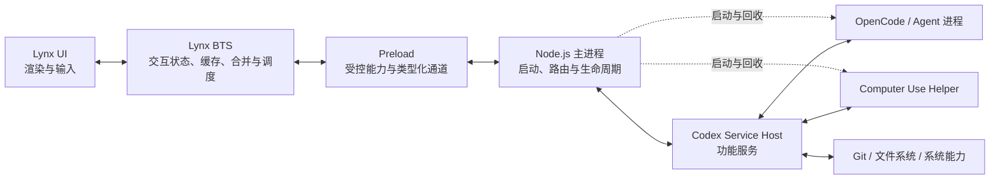
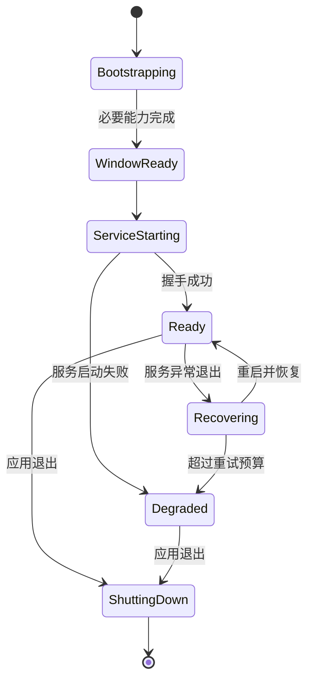

# Codex Demo 进程架构约束

状态：Accepted  
适用范围：`showcases/codex-demo` 桌面端

## 目标

Codex Demo 采用“薄主进程、功能服务化、交互下沉到 Lynx BTS”的架构：

- Node.js 主进程只负责必须阻塞启动的能力加载，以及跨环境通信和生命周期管理。
- Git、工作区、Agent、会话、持久化等功能逻辑全部运行在独立服务中。
- 对交互延迟敏感的状态处理通过 preload 提供受控能力，在 Lynx BTS（Background Thread Script）中完成。
- Lynx UI 只负责视图、用户输入和最终布局，不直接依赖 Node.js API。

这项约束的核心目的不是减少文件数量，而是保证任何功能增长都不会扩大主进程的阻塞面。

## 进程边界



依赖方向必须保持单向：UI 和 BTS 依赖协议，不依赖服务实现；服务不能反向依赖窗口或 UI 组件。

## Node.js 主进程职责

主进程只允许承担以下三类职责。

### 1. 阻塞启动的能力加载

仅包含 UI 启动前必须完成、且无法延迟的工作：

- 校验应用内置资源和版本化 manifest。
- 安装或定位 OpenCode、Computer Use 等随包运行时。
- 完成签名、完整性和可执行权限校验。
- 注册 preload、Native Module 和窗口创建所需能力。
- 建立启动期间唯一的数据目录和安全边界。

这些操作允许阻塞，但必须满足：

- 只在启动阶段运行一次。
- 每个步骤有独立耗时日志。
- 已验证版本必须缓存结果，不能在一次启动中重复执行版本探测。
- 首次安装和普通启动必须区分指标。
- 非必要能力可以在窗口出现后异步预热，不得伪装成启动依赖。

### 2. 多环境通信

主进程是通信路由器，不是业务处理器：

- 连接 Lynx preload、功能服务、Agent 子进程和系统 Helper。
- 转发类型化 request、response、event 和 cancellation。
- 校验来源、协议版本、能力范围和消息大小。
- 为请求分配 ID，维护超时、取消和背压。
- 只执行协议级转换，不解释 Git diff、Agent tool call 等业务语义。

主进程中的 bridge handler 应接近如下形式：

```ts
router.handle('workspace.snapshot', (request, context) =>
  serviceHost.request('workspace.snapshot', request, context.signal),
);
```

handler 内不应出现文件扫描、Git 命令、Markdown 解析或复杂状态合并。

### 3. 生命周期管理

- 创建、显示、隐藏和销毁窗口。
- 启动、监控、重启和回收功能服务。
- 启动并回收 OpenCode、Computer Use 等外部进程。
- 在窗口关闭、应用退出、服务崩溃时执行有界清理。
- 管理单实例、深链、系统菜单和原生对话框。
- 将服务健康状态映射成协议级状态事件。

主进程可以持有“进程是否存活、连接是否就绪”这类生命周期状态，但不能持有任务、消息、diff 或文件树等业务状态。

## 主进程禁止项

除启动阶段外，主进程不得：

- 使用 `spawnSync`、`execFileSync` 或同步 Git 命令。
- 同步扫描工作区或读取大文件。
- 解析、生成或高亮 diff、Markdown、代码和文件树。
- 保存任务、会话、Timeline 或 Review 业务数据。
- 合并流式文本或维护消息列表。
- 轮询业务状态。
- 因 UI 点击执行超过一个轻量路由步骤的工作。
- 向 preload 暴露裸 `fs`、`child_process`、任意命令执行或任意路径读取。

原生窗口、菜单和文件选择框属于桌面生命周期能力，可以保留在主进程。

## 功能服务层

所有功能性 Node.js 逻辑进入独立的 `Codex Service Host`。初期可以是一个独立 Node 子进程，内部按领域拆分服务；只有出现明确隔离需求时才拆成多个进程。

建议领域：

| 服务 | 职责 |
| --- | --- |
| `AgentService` | ACP 连接、Session、Prompt、权限、取消和 Agent 事件标准化 |
| `ConversationService` | Timeline、事件索引、分页、流式文本聚合和历史缓存 |
| `TaskService` | Task 元数据、状态机和配置项 |
| `WorkspaceService` | Git root、文件索引、目录树、文件读取和安全路径解析 |
| `ReviewService` | Git status、变更摘要和按需单文件 diff |
| `PersistenceService` | Task/Session 持久化、debounce、原子写入和 schema migration |
| `ComputerUseService` | Helper 协议、能力探测、请求转发和会话状态 |

服务层要求：

- 文件和子进程 API 默认异步。
- CPU 密集任务放入 Worker Thread 或专用子进程。
- 长操作必须支持取消、超时和进度事件。
- 相同请求应支持缓存、去重或合并。
- 服务崩溃不能带崩桌面主进程。
- 服务重启后通过持久化状态和协议握手恢复，不依赖 UI 重启。

## Preload 与 Lynx BTS

Preload 是安全边界和能力适配器。它把有限、类型化、可取消的接口提供给 Lynx BTS，但不承载领域业务本身。

Lynx BTS 负责所有与交互时序紧密相关、但不需要主线程布局能力的工作：

- 合并 Agent 高频文本增量，并按帧或固定时间片提交给 UI。
- 维护会话级 View Model 和可序列化缓存。
- Timeline 分页去重、请求取消、预取和锚点数据准备。
- Task 切换时的缓存恢复和过期请求隔离。
- Review、Workspace 请求的去重与 latest-wins 调度。
- 将服务事件归一化成 UI 可以直接消费的增量。
- 采集交互链路耗时，不在 UI 渲染路径中写日志或落盘。

以下逻辑仍属于 Lynx UI：

- 组件状态和最终布局。
- List 虚拟化和可见元素管理。
- 手势、hover、focus、selection 等视图交互。
- 依赖实际布局结果的滚动锚点恢复。

Preload/BTS 不得绕过服务层直接执行 Git、访问任意文件或启动进程。

## 通信协议

跨环境协议统一使用版本化 envelope：

```ts
interface RpcRequest<T> {
  protocolVersion: 1;
  requestId: string;
  method: string;
  payload: T;
}

interface RpcResponse<T> {
  protocolVersion: 1;
  requestId: string;
  ok: boolean;
  value?: T;
  error?: { code: string; message: string; retryable?: boolean };
}

interface ServiceEvent<T> {
  protocolVersion: 1;
  stream: string;
  sequence: number;
  payload: T;
}
```

协议必须提供：

- `requestId` 关联响应。
- `sequence` 检测丢失、重复和乱序事件。
- 显式 cancellation。
- 每种 method 的输入输出类型和大小上限。
- 稳定错误码，不能把内部 stack 直接暴露给 UI。
- 服务与 preload 的版本握手。
- 高频流的批量事件格式，避免每个 token 一次跨环境调用。

## 延迟预算

| 链路 | 预算 | 处理位置 |
| --- | ---: | --- |
| hover、按压、选择态 | 单帧内 | Lynx UI |
| 流式文本合并、Task 切换缓存 | 16–40ms | Lynx BTS |
| 本地缓存分页 | 50ms 内 | Lynx BTS |
| 文件树、Git 摘要 | 异步，提供 loading/cancel | Service |
| 单文件 diff、文件读取 | 异步，按需加载 | Service |
| 运行时校验与首次安装 | 可阻塞，仅启动一次 | Main |

任何超过 16ms 的同步主进程操作都需要记录；超过 50ms 必须迁出主进程或证明它是不可延迟的启动依赖。

## 目标目录结构

```text
src/
  app/                         # Lynx UI
  bts/                         # 高频交互状态与事件合并
    conversation-controller.ts
    task-controller.ts
    request-cache.ts
  preload/
    index.ts                   # 最小能力暴露
    codex-api.ts               # 类型化 BTS API
  main/desktop/
    main.ts                    # 组合入口
    bootstrap/                 # 必须阻塞的能力加载
    lifecycle/                 # Window/Service/Helper 生命周期
    transport/                 # RPC 路由、协议校验与背压
  service/
    host.ts
    agent/
    conversation/
    task/
    workspace/
    review/
    persistence/
  shared/
    protocol/                  # 跨环境 DTO、错误码和版本
```

## 当前代码迁移映射

| 当前模块 | 目标位置 | 处理方式 |
| --- | --- | --- |
| `main.ts` 中 runtime 安装 | `main/desktop/bootstrap` | 保留主进程，去重校验并记录启动耗时 |
| `main.ts` bridge switch | `main/desktop/transport` | 改成声明式路由和服务代理 |
| `agents/runtime.ts` | `service/agent`、`service/conversation`、`service/task` | 按领域拆分，不再由主进程实例化 |
| `agents/acp-client.ts` | `service/agent` | 由服务拥有 Agent 子进程和 stdio |
| `agents/workspace-service.ts` | `service/workspace` | 全异步并缓存 Git root/文件索引 |
| `agents/review-service.ts` | `service/review` | 全异步、先应用 pathspec、单文件 diff 按需加载 |
| `agents/task-store.ts` | `service/persistence` | debounce、批量提交、退出前 flush |
| App 中流式消息合并 | `bts/conversation-controller.ts` | BTS 合并后批量通知 UI |
| App 中请求去重与 Task 缓存 | `bts` | 使用 request generation 和 cancellation |

## 生命周期状态机



窗口不应因为功能服务崩溃而退出。`Degraded` 状态下 UI 仍可打开，并展示可恢复的错误和重试入口。

## 验收标准

- 主进程除 bootstrap 目录外没有 `spawnSync`、`execFileSync` 或大文件同步 IO。
- 主进程不导入 Workspace、Review、TaskStore 或 ACP 业务实现。
- 普通启动不会重复执行相同 runtime 的版本和签名校验。
- 所有功能请求都可定位到独立 Service method。
- 所有长操作可取消，并且 Task 切换后旧响应不会污染当前 UI。
- 高频 Agent 输出经过 BTS 合并，跨环境事件频率有明确上限。
- 服务被强制终止后，窗口保持存活并能自动恢复或进入 Degraded 状态。
- 10,000 条消息、5,000 个文件和大 diff 场景不会造成主进程 event-loop 长任务。
- 启动、请求、服务处理和 UI 稳定四段耗时可以独立观测。

## 迁移顺序

1. 先建立共享协议、Service Host 和主进程 transport，不改变 UI 行为。
2. 迁移 Workspace 与 Review，优先消除交互路径上的同步 Git 和文件 IO。
3. 迁移 TaskStore 和 Task 状态机，增加 debounce 与退出 flush。
4. 迁移 ACP Client、AgentRuntime 和 Timeline，使 Agent 子进程归服务管理。
5. 建立 preload/BTS controller，迁移流式文本合并、缓存、取消和请求去重。
6. 删除旧 bridge 业务 handler，加入架构约束检查和压力测试。

每一步必须保持协议兼容并可独立回滚，避免一次性重写主进程、服务和 UI。
